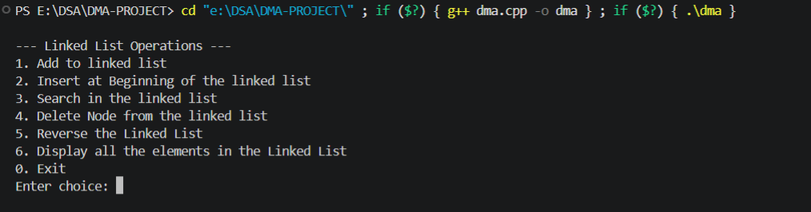
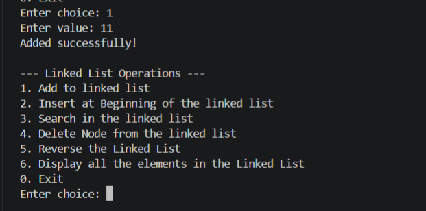
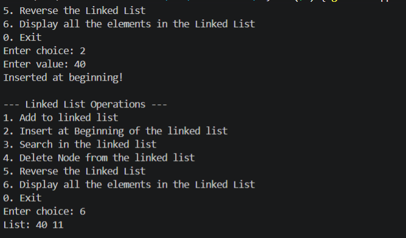
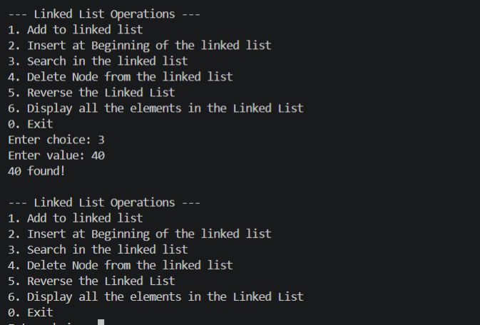
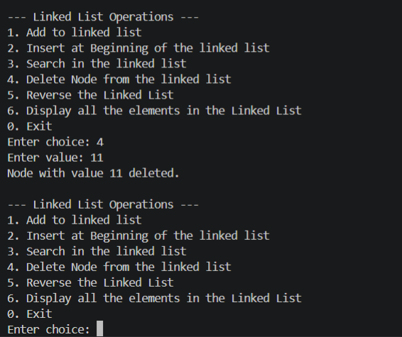
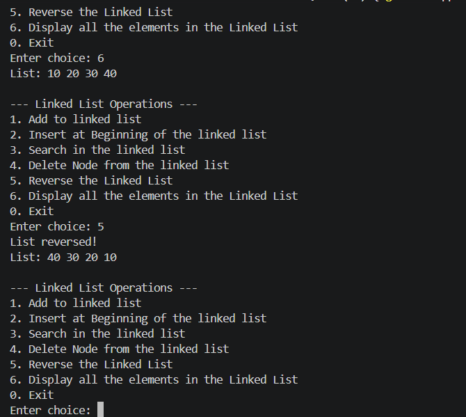
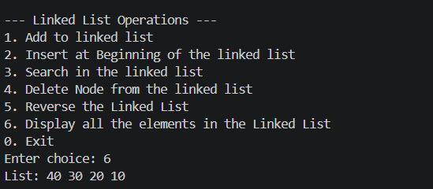

# Dynamic Memory Allocation - Linked List CRUD Operations

## Project Overview
This project implements a simple CRUD (Create, Read, Update, Delete) operation in a Linked List using C++ with dynamic memory allocation.

## Features Implemented
1. **Basic Linked List Implementation**: append() and display() methods
2. **Insert at Beginning**: insert_at_beginning(data) method
3. **Search Operation**: Search(key) method to find elements
4. **Delete Node**: Delete_node(key) method to remove nodes by value
5. **Reverse List**: reverse() method to reverse the linked list

## Class Structure

### Node Class
- **Attributes**:
  - `int data`: Stores the node value
  - `Node* next`: Pointer to the next node

### DynamicMemoryAllocation Class (Base Class)
- **Attributes**:
  - `Node* head`: Pointer to the first node

- **Methods**:
  - `append(data)`: Add node at the end
  - `insert_at_beginning(data)`: Insert node at the beginning
  - `Search(key)`: Search for a value in the list
  - `Delete_node(key)`: Delete a node by value
  - `reverse()`: Reverse the entire linked list
  - `display()`: Display all nodes in the list

## How to Compile and Run

```bash
g++ dma.cpp -o dma
./dma
```

For Windows:
```bash
g++ dma.cpp -o dma.exe
dma.exe
```

## Menu Options
1. Append - Add element at the end
2. Insert at Beginning - Add element at the start
3. Search - Find an element in the list
4. Delete Node - Remove an element by value
5. Reverse List - Reverse the entire list
6. Display List - Show all elements
7. Exit - Close the program

## Output Screenshots

### 1. Initial Menu


### 2. Adding Operation


### 3. Insert at Beginning


### 4. Search Operation


### 5. Delete Operation



### 6. Reverse Operation



### 7. Display Operation



## Key Concepts Demonstrated
- Dynamic memory allocation using `new` operator
- Proper memory deallocation using `delete` operator
- Destructor implementation for cleanup
- Pointer manipulation
- Linked list traversal
- CRUD operations on data structures

## Time Allocation
- Basic Linked List Implementation: 30 mins
- Insert at Beginning & Search: 30 mins
- Deletion of Node: 30 mins
- Reversing the Linked List: 30 mins

**Total Duration**: 4 Hours

## Author
PRAYASH JENA

## Date
29-04-2026
